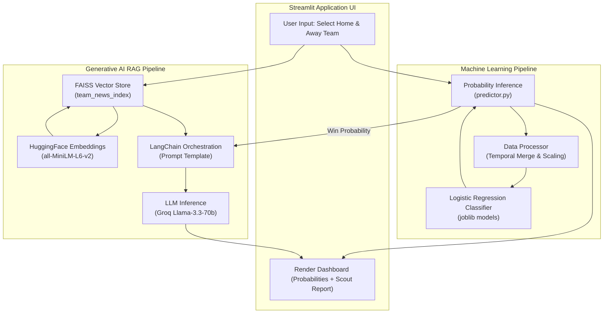
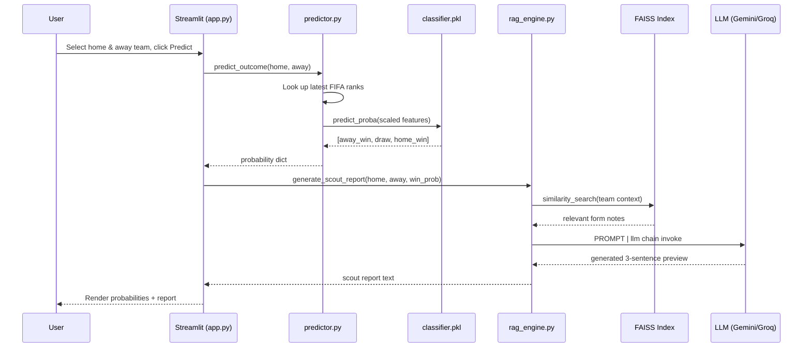

# <div align="center"> ⚽ Match Oracle </div>
 
### <div align="center"> AI-Powered Football Outcome Predictor & LangChain RAG Scout Report Generator </div>

## <div align="center">           </div>
<!--  -->
 

Match Oracle predicts international football match outcomes using a Logistic Regression model trained on 20+ years of FIFA ranking and match history data, then pairs that prediction with an AI-generated scouting report, built with a genuine **LangChain RAG pipeline** (FAISS vector search + prompt templates) instead of a bare API call. Pick two teams, get a win/draw/loss probability, and read a context-grounded tactical preview, all in one Streamlit page.
 
## <div align="center"></div>
<!--  -->

---
 
## Table of Contents
 
* [Features](#features)
* [Tech Stack](#tech-stack)
* [System Architecture](#system-architecture)
* [Project Structure](#project-structure)
* [Getting Started](#getting-started)
* [Environment Variables](#environment-variables)
* [API Reference](#api-reference)
* [Application Flow](#application-flow)
* [Known Issues & Lessons Learned](#known-issues--lessons-learned)
* [Sponsor](#sponsor)
* [License](#license)
---
 
## Features
 
- 🔮 **Match outcome prediction**: Logistic Regression classifier trained on 23,000+ international matches (2000–2024), predicting home win / draw / away win probabilities from FIFA rank difference and venue neutrality.
- 🤖 **AI scout reports**: a real LangChain RAG chain (not a raw prompt string) retrieves each team's current form from a curated knowledge base and generates a grounded, 3-sentence tactical preview.
- 📊 **Feature-scaled model**: inputs are standardized with `StandardScaler` so the model weighs rank difference on equal footing with categorical features, instead of one feature silently drowning out the other.
- 🌍 **Team-name reconciliation**: a mapping layer resolves spelling mismatches between the two source datasets (e.g. `Iran` ↔ `IR Iran`, `USA` ↔ `United States`) so real matches aren't silently dropped during the merge.
- 🖥️ **One-page Streamlit UI**: team dropdowns, live probability metrics, and an AI-generated report, no page reloads or extra tabs.
- 🔌 **Swappable LLM backend**: the RAG chain works identically with Google Gemini or Groq (Llama) behind a single `PROMPT | llm` LangChain expression, so switching providers is a two-line change.
---
 
## Tech Stack
 
| Layer | Technology | Purpose |
|---|---|---|
| Data processing | **Pandas**, **NumPy** | Cleaning, merging, and feature engineering on raw Kaggle CSVs |
| ML model | **scikit-learn** (Logistic Regression + StandardScaler) | Multi-class outcome prediction from rank difference and venue |
| Model persistence | **joblib** | Save/load trained model and scaler without retraining on every run |
| Embeddings | **sentence-transformers** (`all-MiniLM-L6-v2`) via `langchain-huggingface` | Local, free text embeddings for the RAG knowledge base |
| Vector store | **FAISS** | In-memory similarity search over team news/form data |
| LLM orchestration | **LangChain** (`ChatPromptTemplate`, LCEL chains) | Wires the retriever, prompt, and LLM into a single reusable chain |
| LLM provider | **Google Gemini** / **Groq (Llama)** | Generates the final natural-language scout report |
| Frontend | **Streamlit** | Single-page interactive web app |
| Config | **python-dotenv** | Loads API keys from `.env` without hardcoding secrets |
| Version control | **Git & GitHub** | Phase-by-phase commit history, branching |
 
---
 
## System Architecture
 
Match Oracle employs a hybrid architecture, orchestrating two parallel pipelines: a Classical Machine Learning pipeline for objective outcome probability prediction based on historical data, and a Generative AI (RAG) pipeline for subjective, context-aware tactical scouting reports. Both pipelines converge in a decoupled Streamlit frontend.



### 1. Data Processing Pipeline (`src/data_processor.py`)
The foundation of the ML model is robust data engineering:
*   **Data Harmonization:** Standardizes team nomenclature across distinct Kaggle datasets (International Matches vs. FIFA Rankings) using a curated mapping dictionary (`NAME_FIXES`). This prevents silent data loss during joins.
*   **Temporal Joins:** Utilizes Pandas' `merge_asof` for backward-looking temporal joins. This guarantees that for any historical match, the model joins the most recent FIFA ranking points *strictly prior* to the match date, strictly eliminating data leakage from the future.
*   **Feature Engineering:** Extracts `points_diff` (home points minus away points) and encodes `neutral_venue` as a binary indicator, forming the feature vector. The multi-class target is calculated from match scores (Away Win, Draw, Home Win).

### 2. Machine Learning Pipeline (`src/model_trainer.py` & `src/predictor.py`)
A fast, well-calibrated classical ML approach is used for predictive probabilities:
*   **Model Selection:** Employs scikit-learn's `LogisticRegression`. This algorithm is specifically chosen over tree-based models for its inherently well-calibrated, continuous probability distributions.
*   **Feature Scaling:** Applies `StandardScaler` to ensure that `points_diff` (a large continuous variable) and `neutral_venue` (a binary variable) are on identical scales, preventing coefficient dominance.
*   **Artifact Persistence:** The trained classifier and the fitted scaler are serialized via `joblib` into the `models/` directory. This decouples training from inference, allowing the Streamlit app to load pre-computed artifacts for sub-second predictions without retraining.

### 3. Retrieval-Augmented Generation (RAG) Pipeline (`src/rag_engine.py`)
Generates context-grounded tactical narratives instead of generic LLM hallucinations:
*   **Knowledge Base & Embeddings:** Ingests curated team form notes (`context/team_news.csv`) and generates dense semantic embeddings using `sentence-transformers/all-MiniLM-L6-v2` via HuggingFace.
*   **Vector Retrieval:** Stores embeddings in a local `FAISS` (Facebook AI Similarity Search) index. At inference, it performs a k-NN similarity search (`k=4`) against the index using the query `"{home_team} {away_team} recent form"` to retrieve the most pertinent contextual snippets.
*   **LangChain Orchestration:** Constructs a robust pipeline (`PROMPT | llm`) utilizing LangChain's `ChatPromptTemplate`. The prompt dynamically injects the retrieved FAISS context, the selected teams, and critically, the *ML-predicted win probability* generated by `predictor.py`.
*   **LLM Inference:** Dispatches the composite prompt to Groq's API utilizing the high-performance `llama-3.3-70b-versatile` model, generating a strict, 3-sentence tactical preview grounded exclusively in the provided context.

### 4. Application Frontend (`app.py`)
A monolithic but logically separated orchestration layer:
*   **UI/UX:** Built with Streamlit, heavily customized with injected CSS (`st.markdown(unsafe_allow_html=True)`) to deliver a modern, card-based interface (e.g., custom progress bars for win probabilities, flexbox layouts).
*   **State Management:** Utilizes Streamlit's `session_state` to manage interactive UI elements like the bi-directional team swapper button without triggering unnecessary full-page refreshes.
*   **Orchestration:** Acts as the sole convergence point. It simultaneously dispatches calls to `predict_outcome()` and `generate_scout_report()`, awaiting both the deterministic ML probabilities and the generative AI narrative before rendering the unified dashboard.
 
---
 
## Project Structure
 
```
match-oracle/
├── .env                          # API keys (GROQ_API_KEY) 
├── .gitignore
├── .streamlit/
│   └── config.toml               # File watcher config (avoids transformers/torchvision import noise)
├── requirements.txt
├── README.md
├── app.py                        # Streamlit entrypoint: the only file touching the UI
├── data/
│   ├── raw/
│   │   ├── results.csv           # International match history (Kaggle)
│   │   └── fifa_ranking.csv      # FIFA World Ranking history (Kaggle)
│   └── processed/
│       └── training_data.csv     # Cleaned, merged, feature-engineered output
├── context/
│   └── team_news.csv             # Hand-curated "live" team form: the RAG knowledge base
├── vectorstore/
│   └── team_news_index/          # FAISS index, built once from team_news.csv, loaded at runtime
├── models/
│   ├── classifier.pkl            # Trained Logistic Regression model
│   └── scaler.pkl                # Fitted StandardScaler (must accompany the model)
├── notebooks/
│   └── 01_eda_and_prep.ipynb     # EDA scratchpad: class balance, rank_diff distribution checks
└── src/
    ├── __init__.py
    ├── data_processor.py         # CSV cleaning, team-name mapping, merge_asof, feature engineering
    ├── model_trainer.py          # Train/test split, scaling, Logistic Regression, evaluation
    ├── rag_engine.py             # FAISS vector store, prompt template, LangChain LLM chain
    └── predictor.py              # Rank lookup + scaled prediction: the glue app.py calls into
```
 
---
 
## Getting Started
 
### Prerequisites
- Python 3.11+ (or your installed version — see note on compatibility below)
- Git
- A free [Groq API key](https://console.groq.com/keys)
- Kaggle account (to download the two datasets)
### Installation
 
```bash
# 1. Clone the repository
git clone https://github.com/<your-username>/match-oracle.git
cd match-oracle
 
# 2. Create and activate a virtual environment
python -m venv env
source env/bin/activate        # Mac/Linux
env\Scripts\activate           # Windows PowerShell
 
# 3. Install dependencies
pip install -r requirements.txt
 
# 4. Download the datasets and place them here:
#    data/raw/results.csv       <- International football results (Kaggle: martj42)
#    data/raw/fifa_ranking.csv  <- FIFA World Ranking (Kaggle: cashncarry)
 
# 5. Set up your .env file (see Environment Variables below)
 
# 6. Run the data pipeline and train the model
python src/data_processor.py
python src/model_trainer.py
 
# 7. Launch the app
streamlit run app.py
```
 
The app opens at `http://localhost:8501`. On first prediction, the RAG pipeline builds and caches a FAISS index from `context/team_news.csv` — this takes a few extra seconds only on the very first run.
 
---
 
## Environment Variables
 
Create a `.env` file in the project root (already excluded from Git via `.gitignore`):
 
```env
GEMINI_API_KEY=your_gemini_key_here
# — or, if using the Groq backend instead —
GROQ_API_KEY=your_groq_key_here
```
 
`src/rag_engine.py` loads these automatically via `python-dotenv`'s `load_dotenv()` at import time — no manual wiring needed elsewhere in the codebase.
 
**For deployment (Streamlit Community Cloud):** `.env` is never read in the cloud. Add the same key(s) under your app's **Settings → Secrets** in TOML format instead.
 
---
 
## API Reference
 
This project doesn't expose a REST API — "API" here refers to the internal Python module functions each part of the app calls into.
 
### `src/data_processor.py`
| Function | Description |
|---|---|
| `load_and_merge(matches_path, rankings_path)` | Loads both CSVs, applies team-name fixes, and merges each match with the correct team's most recent FIFA rank using `merge_asof` |
| `engineer_features(df)` | Computes `rank_diff`, `neutral_venue`, and the 3-class `outcome` target |
| `process_football_data(matches_path, rankings_path, output_path)` | Runs the full pipeline and writes `training_data.csv` |
 
### `src/model_trainer.py`
| Function | Description |
|---|---|
| `train_and_save_model(data_path, model_output_path, scaler_output_path)` | Splits data, fits a `StandardScaler`, trains a `LogisticRegression` classifier, prints a `classification_report`, and saves both artifacts via `joblib` |
 
### `src/predictor.py`
| Function | Description |
|---|---|
| `get_latest_rank(rankings_df, team)` | Returns a team's most recent FIFA rank |
| `predict_outcome(model_path, rankings_df, home_team, away_team, neutral=0)` | Loads the model and scaler, computes `rank_diff`, and returns `{away_win, draw, home_win}` probabilities |
 
### `src/rag_engine.py`
| Function | Description |
|---|---|
| `build_vectorstore(csv_path)` | Embeds `team_news.csv` rows and saves a FAISS index |
| `load_vectorstore()` | Loads the saved index, or builds it if missing |
| `generate_scout_report(home_team, away_team, win_prob)` | Retrieves relevant team context, fills the prompt template, and returns the LLM-generated preview |
 
---
 
## Application Flow
 

 
---
 
<!-- ## Known Issues & Lessons Learned
 
Documenting this because working through it was most of the actual engineering effort:
 
- **Silent data loss from index misalignment (fixed):** the initial `merge_asof` pipeline was retaining only ~4% of eligible matches. The root cause was assigning `merge_asof`'s freshly-indexed output back onto a `DataFrame` that still carried its original, non-sequential index — pandas aligned by index label instead of row position, silently producing `NaN`s almost everywhere. Fixed with a single `.reset_index(drop=True)` before merging, recovering match retention to **91.8%**.
- **Unscaled features skewing the model (fixed):** `rank_diff` (range ≈ ±200) and `neutral_venue` (0 or 1) were fed into Logistic Regression without scaling, so the model's coefficients compensated by nearly ignoring `rank_diff` entirely. Fixed by fitting a `StandardScaler` on the training features and persisting it alongside the model.
- **Draw prediction remains weak:** with only two features, the model rarely predicts draws — a well-known hard case in football analytics, since draws don't correlate as cleanly with rank gap as decisive wins do. Planned improvement: add recent-form or head-to-head features.
- **Live model deprecation mid-build:** `gemini-1.5-flash` and later `gemini-2.5-flash-lite` were both retired by Google during development, requiring a mid-project provider swap — handled cleanly thanks to LangChain's provider-agnostic `PROMPT | llm` interface.
--- -->
 
## Sponsor
 
Match Oracle is an independent student project, not currently backed by any sponsor. If this project helped you learn something or you'd like to support future development, a star ⭐ on the repo goes a long way.
 
---
 
## License & Credit
 
This project is licensed under the **MIT License** — see the [LICENSE](LICENSE) file for details. In short: free to use, modify, and distribute, with attribution appreciated.

Background GIF: https://cdna.artstation.com/p/assets/images/images/075/142/478/original/aidan-yelamos-berbel-footballnight.gif?1713861751

Background GIF Artist credit: https://www.artstation.com/aidanyelamos
 
---

 
#### <div align="center">Made with ❤️ using Python, Pandas, NumPy, scikit-learn, LangChain, FAISS, Streamlit & Groq by **Abhimanyu Kumar**, **Adrija Das**, **Arpan Paul** and  **Anasuya Chatterjee**</div>


