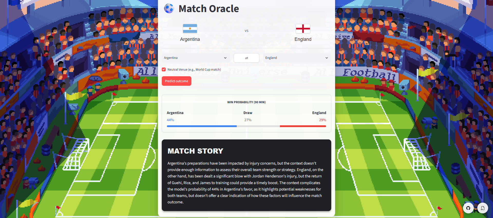
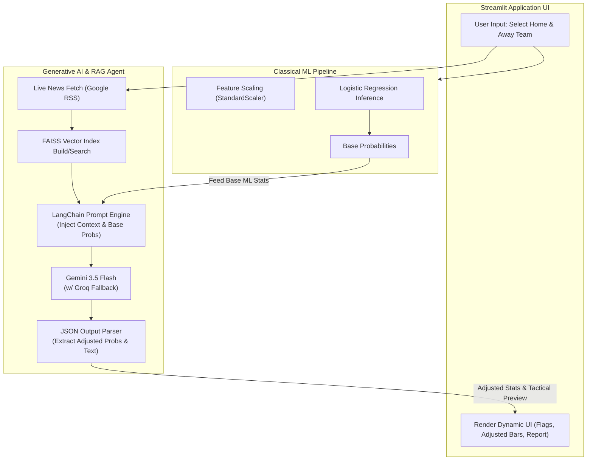

# <div align="center"> ⚽ Match-Oracle: AI-Powered Football Predictor & Dynamic RAG Agent</div>
 
### <div align="center"> A Hybrid ML + Generative AI Pipeline for Context-Aware Predictions </div>

## <div align="center">      </div>
 

Match-Oracle is an advanced international football outcome predictor that bridges the gap between **Classical Machine Learning** and **Generative AI**. It uses a Logistic Regression model trained on 20+ years of FIFA data to establish baseline win/loss probabilities based on team forms and Head-to-Head (H2H) statistics. Then, a dynamic **LangChain RAG (Retrieval-Augmented Generation) Pipeline** fetches real-time team news, embeds it using HuggingFace, and utilizes **Google Gemini 3.5 Flash** (with a Groq Llama-3.3 fallback) as a reasoning agent to synthetically adjust those probabilities and generate a tactical preview.

This repository serves as a comprehensive case study in **Prompt Engineering, Structured LLM Outputs, and Dynamic RAG architectures**, making it an ideal reference for Generative AI and Prompt Engineering applications.
 
## <div align="center"></div>

---
 
## Table of Contents
 
* [Generative AI & Prompt Engineering Focus](#generative-ai--prompt-engineering-focus)
* [System Architecture](#system-architecture)
* [Features](#features)
* [Tech Stack](#tech-stack)
* [Getting Started](#getting-started)
* [Project Structure](#project-structure)
* [Application Flow](#application-flow)
* [License](#license)

---

## Generative AI & Prompt Engineering Focus

This project is heavily optimized to demonstrate advanced Prompt Engineering and GenAI Agent mechanics, designed specifically to satisfy advanced coursework requirements.

### 1. Dynamic RAG (Live Web Scraping)
Instead of relying on a static, hallucination-prone LLM, the application executes a live context-gathering phase:
- A custom script (`update_news.py`) queries Google News RSS feeds in real-time for specific football-related keywords (e.g., "injury", "ruled out", "form").
- The fetched headlines are stored in a temporary knowledge base, dynamically embedded via `sentence-transformers/all-MiniLM-L6-v2`, and indexed in **FAISS**.
- The top $K$ most relevant news items are retrieved and injected into the LLM prompt.

### 2. Advanced Prompt Engineering
The system utilizes a complex, multi-constraint prompt (`src/rag_engine.py`) designed for algorithmic reasoning rather than just generic text generation:

*   **Role-Playing & Persona:** The LLM is instructed to act as a "sharp, concise football commentator and data analyst."
*   **Context Injection:** The LLM is provided with deterministic baseline statistics (predicted by the ML model) and the live scraped news context.
*   **Reasoning & Constraint Satisfaction:** 
    - *Task:* Adjust the ML base probabilities based on the news (e.g., if a star player is injured, lower the win probability).
    - *Constraint:* Adjustments are strictly limited to a **maximum of +/- 10%**.
    - *Constraint:* The final probabilities MUST mathematically sum to exactly 100%.
*   **Structured Output Parsing (JSON Schema):** To allow the Python backend and Streamlit frontend to physically alter the UI progress bars based on the LLM's "thoughts", the prompt enforces a strict JSON output schema. This is handled flawlessly via LangChain's `JsonOutputParser`.

**The Prompt:**
```text
You are a sharp, concise football commentator and data analyst. 
{home_team} is playing {away_team}.
Venue: {venue_status}

Our statistical model gives the following base probabilities:
- {home_team} Win: {base_home_prob}%
- Draw: {base_draw_prob}%
- {away_team} Win: {base_away_prob}%

Retrieved context (pre-labeled by team):
{context}

INSTRUCTIONS:
1. Read the context to see if there are major injuries, morale issues, or exceptional form.
2. Adjust the base probabilities based on this news. Limit adjustments to a maximum of +/- 10% from the base. The final probabilities MUST sum exactly to 100.
3. Write a punchy 3-sentence tactical preview based strictly on this context. Note how the news shifted the odds.

You MUST respond ONLY with a valid JSON object matching this schema:
{{
    "adjusted_home_win": 60,
    "adjusted_draw": 20,
    "adjusted_away_win": 20,
    "tactical_preview": "String here..."
}}
```

---
 
## System Architecture
 
Match-Oracle orchestrates two parallel pipelines that converge to form a single "Agentic" workflow.



---
 
## Features
 
- 🤖 **LLM-Driven Probability Adjustment**: Uses Gemini 3.5 Flash to read live news, reason about injuries or form, and mathematically adjust base predictions (via strict JSON output).
- 📰 **Live Context Scraping**: Automatically fetches real-time team news via RSS prior to prediction, ensuring the LLM reasons on today's data, eliminating training-cutoff hallucinations.
- 🔮 **Classical ML Foundation**: A Logistic Regression classifier trained on 23,000+ matches (2000–2024), utilizing standardized feature scaling and complex Head-to-Head (H2H) calculations.
- 🌍 **Dynamic UI & Assets**: One-page Streamlit app featuring animated backgrounds, dynamic probability progress bars, and real-time team flag rendering via `pycountry` and the FlagCDN API.
- ⚡ **Resilient Agentic Architecture**: Uses **Google Gemini 3.5 Flash** for rapid, accurate structured output, with **Groq (Llama-3.3-70b)** automatically kicking in as a high-speed fallback if rate limits are hit.

---
 
## Tech Stack
 
| Layer | Technology | Purpose |
|---|---|---|
| **LLM Provider (Primary)** | **Google Gemini (3.5 Flash)** | Advanced instruction-following and strict JSON output |
| **LLM Provider (Fallback)**| **Groq (Llama-3.3-70b)** | High-speed backup reasoning engine |
| **LLM Orchestration** | **LangChain** | Wires retrievers, prompt templates, and JSON parsers |
| **Data Scraping** | **urllib / XML ET** | Real-time querying of Google News RSS feeds |
| **Vector Store & Embeddings**| **FAISS & HuggingFace** | In-memory similarity search over scraped live news |
| **Machine Learning** | **scikit-learn / joblib** | Logistic Regression prediction and artifact persistence |
| **Data Processing** | **Pandas, NumPy** | Feature engineering and `merge_asof` temporal joins |
| **Frontend UI** | **Streamlit** | Interactive dashboard with custom CSS and Flag API integration |

---
 
## Getting Started
 
### Prerequisites
- Python 3.11+
- A free [Google AI Studio API Key](https://aistudio.google.com/apikey)
- A free [Groq API key](https://console.groq.com/keys) (optional fallback)
 
### Installation
 
```bash
# 1. Clone the repository
git clone https://github.com/abhi-dev-codes/Match-Oracle.git
cd Match-Oracle
 
# 2. Create and activate a virtual environment
python -m venv env
source env/bin/activate        # Mac/Linux
env\Scripts\activate           # Windows PowerShell
 
# 3. Install dependencies
pip install -r requirements.txt
 
# 4. Set up your .env file
echo "GOOGLE_API_KEY=your_gemini_key_here" > .env
echo "GROQ_API_KEY=your_groq_key_here" >> .env

# 5. Launch the app (Model is pre-trained in /models)
streamlit run app.py
```
 
---
 
## Project Structure
 
```text
match-oracle/
├── app.py                        # Streamlit UI: orchestrates ML and LLM pipelines
├── update_news.py                # Agent Tool: Scrapes Google News for live team context
├── context/
│   └── team_news.csv             # Auto-updated knowledge base for RAG
├── vectorstore/                  # FAISS index (built dynamically at runtime)
├── models/
│   ├── classifier.pkl            # Pre-trained Logistic Regression model
│   └── scaler.pkl                # Fitted StandardScaler
├── src/
│   ├── data_processor.py         # CSV cleaning, temporal joins
│   ├── model_trainer.py          # Train/test split, Logistic Regression setup
│   ├── rag_engine.py             # LangChain Prompts, JSON Parsing, FAISS integration
│   └── predictor.py              # ML Inference logic
└── public/                       # Static UI assets (GIFs, SVGs)
```
 
---

## Application Flow

1. **User Interaction**: User selects a Home and Away team in the Streamlit UI.
2. **ML Prediction**: `app.py` calls `predictor.py`, which loads the serialized `classifier.pkl` and calculates baseline win/draw/loss probabilities based on historical FIFA points.
3. **Live Data Fetch**: `app.py` calls `rag_engine.py`, which triggers `update_news.py`. This script hits Google News RSS, scrapes the latest 5 headlines for both teams based on injury/form keywords, and saves them to `context/team_news.csv`.
4. **Vector Retrieval**: The FAISS index is instantly rebuilt with the fresh news, and the top relevant snippets are retrieved.
5. **LLM Reasoning**: LangChain passes the structured prompt (containing the base probabilities, the prompt constraints, and the live context) to Gemini 3.5 Flash (or Groq if rate-limited).
6. **JSON Parsing & UI Update**: The LLM returns a structured JSON payload containing the dynamically adjusted probabilities and a narrative text. The UI updates the progress bars to reflect the AI's final verdict.

---
 
## License & Credit
 
This project is licensed under the **MIT License**.

Background GIF Artist credit: [Aidan Yelamos](https://www.artstation.com/aidanyelamos)
 
---

#### <div align="center">Made with ❤️ using Python, LangChain, Gemini, Groq & Streamlit by **Abhimanyu Kumar**, **Adrija Das**, **Arpan Paul** and  **Anasuya Chatterjee**</div>
